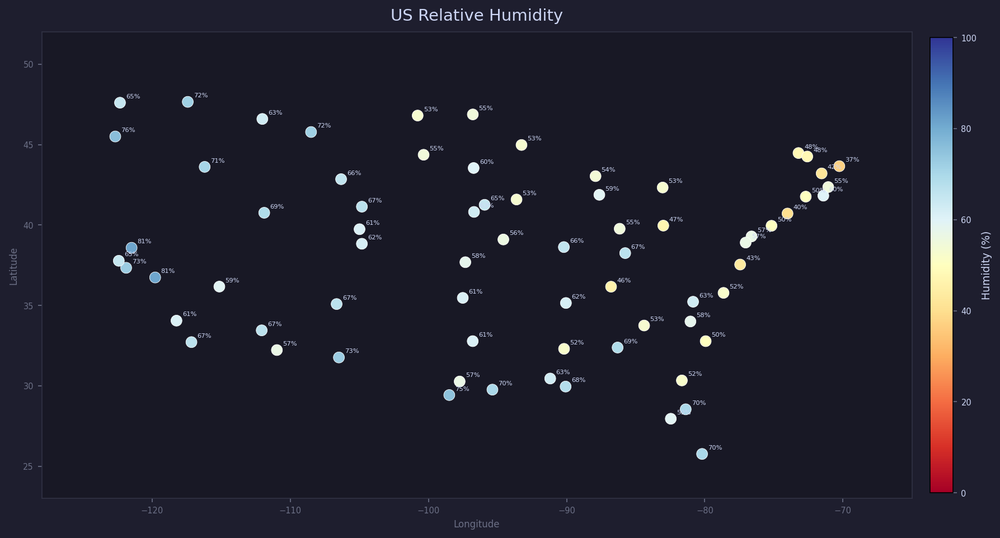

# us-humidity-map

UI that fetches current relative humidity for 70+ US cities from OpenWeatherMap and plots them on an interactive map. Color-coded from dry (red) to humid (blue).



## Setup

get a free API key at [openweathermap.org](https://openweathermap.org/api), then:

```bash
pip install -r requirements.txt
export OWM_API_KEY=your_key_here   # Windows: set OWM_API_KEY=your_key_here
python main.py
```

refresh in the app to fetch live data.
